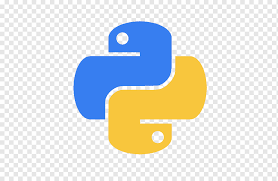

ETL pipeline with OpenSea API

### Table of Contents

- [Prerequisites](#prerequisites)
- [Getting Started](#getting-started)

### Prerequisites

-  _Python @3.X and up_

#

### Getting Started

1. **Clone the repository**:

   ```bash
   git clone https://github.com/NikaKhiz/sweeft_etl_pipeline.git
   cd sweeft_etl_pipeline
   ```

2. **Create a virtual environment**:

   ```bash
   python -m venv venv
   ```

3. **Activate the virtual environment**:

   - On Windows:
     ```bash
     venv\Scripts\activate
     ```
   - On macOS/Linux:
     ```bash
     source venv/bin/activate
     ```

4. **Install all of the necessary libraries**:

   ```bash
   pip install -r requirements.txt
   ```

5. **Generate .env file from .env.example and provide necessary variable values**:

   ```bash
   cp .env.example .env
   ```

## Usage

**Run scripts**:

- Simply run the `python main.py` command :

```bash
python manage.py runserver
```

### the code above will fetch etherium based collections from opensea api and display it in terminal.
